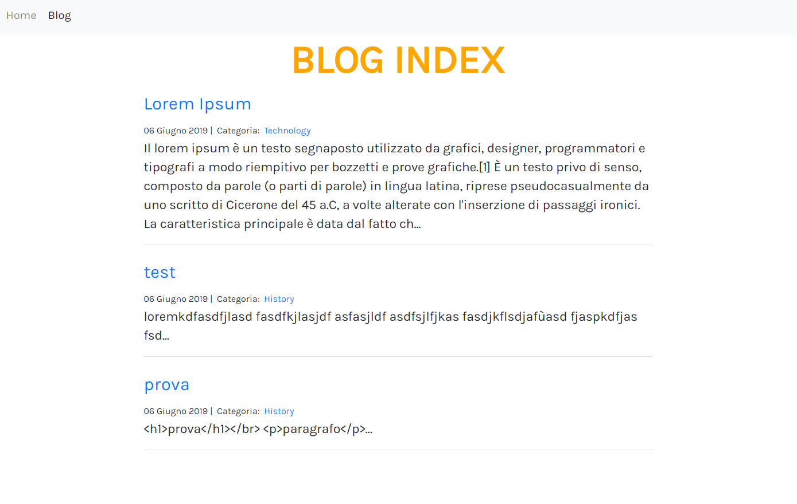
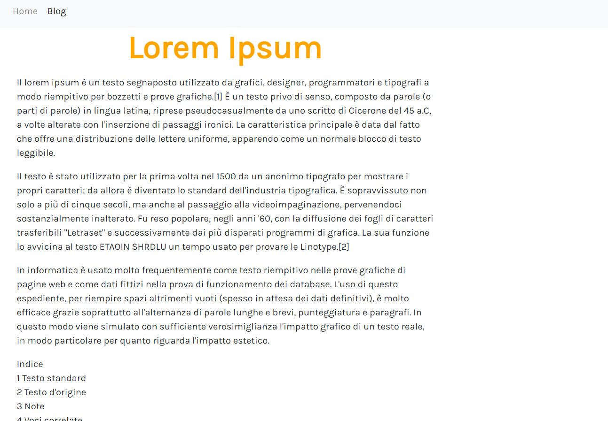
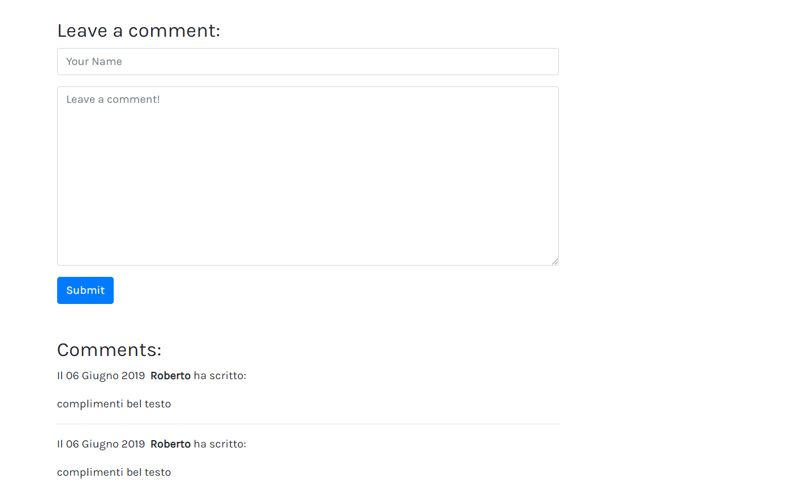

# DjangoBlog

Progetto personale per provare il framework Django.

Sito ancora allo stato iniziale con possibilità di creare post e aggiungere commenti.

Il sito ha solo lo scheletro base e mancano ancora tutta la parte grafica

 
<b>BLOG INDEX</b>

 
<b>BLOG POST</b>

 
<b>BLOG COMMENTS</b>

